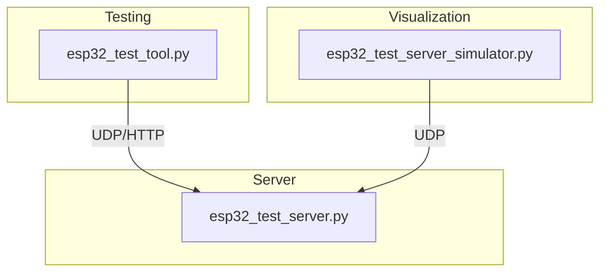

# ESP32 Robot Arm Control System

A development and testing environment for ESP32-based robot arm control systems, featuring a mock server, test tools, and 3D visualization.

## Components

### 1. ESP32 Mock Server (`esp32_test_server.py`)
- Simulates an ESP32-based robot arm controller
- Implements UDP protocol for robot control
- Supports multiple joints with realistic movement simulation
- Handles commands like joint angle control and status monitoring

### 2. 3D Visualization (`esp32_test_server_simulator.py`)
- Real-time 3D visualization of the robot arm
- Connects to mock server via UDP
- Displays joint angles and movement
- Interactive matplotlib-based interface

### 3. Testing Tool (`esp32_test_tool.py`)
- Comprehensive testing suite for robot arm control
- Supports both UDP and HTTP protocols
- Interactive and automated testing modes
- Command-line interface for manual control

## Architecture



## Features

- **Mock Server:**
  - UDP communication protocol
  - Realistic servo movement simulation
  - Multi-joint support (default: 6 joints)
  - Emergency stop functionality
  - Client connection management

- **3D Visualization:**
  - Real-time joint angle display
  - 3D perspective view
  - Forward kinematics calculation
  - Automatic connection handling

- **Testing Tool:**
  - UDP and HTTP protocol support
  - Interactive command mode
  - Automated test sequences
  - PWM-to-angle conversion utilities

## Setup and Usage

### 1. Install Dependencies
```bash
pip install -r requirements.txt
```

### 2. Start the Mock Server
```bash
python esp32_test_server.py
```

### 3. Run the 3D Visualization
```bash
python esp32_test_server_simulator.py
```

### 4. Use the Testing Tool
```bash
# Run automated tests
python esp32_test_tool.py --mock

# Interactive mode
python esp32_test_tool.py --mock -i

# For real hardware (replace with actual IP)
python esp32_test_tool.py --ip 192.168.1.100
```

## Protocol Specification

### UDP Commands
- `CONNECT` - Initialize connection
- `DISCONNECT` - Close connection
- `GET_JOINT_ANGLES` - Get current joint angles
- `SET_JOINT_ANGLE,<joint>,<angle>,<speed>` - Control single joint
- `SET_ALL_JOINT_ANGLES,<angle1>,<angle2>,...,<speed>` - Control all joints
- `EMERGENCY_STOP` - Stop all movements

### HTTP Endpoints (When using real hardware)
- `GET /servos` - Get servo status
- `POST /servos` - Update servo positions
- `POST /stop_all` - Emergency stop

## Configuration

### Mock Server
- Default Host: 127.0.0.1
- Default UDP Port: 4210
- Number of Joints: 6 (configurable)

### 3D Visualization
- Link Lengths: [35, 160, 120, 90, 65, 36] mm
- Update Interval: 50ms
- View Angle: 25° elevation, 45° azimuth

### Testing Tool
- UDP Timeout: 2.0 seconds
- PWM Frequency: 50Hz
- Angle Range: 0-180 degrees

## Contributing

1. Fork the repository
2. Create your feature branch
3. Commit your changes
4. Push to the branch
5. Create a new Pull Request

## License

MIT License