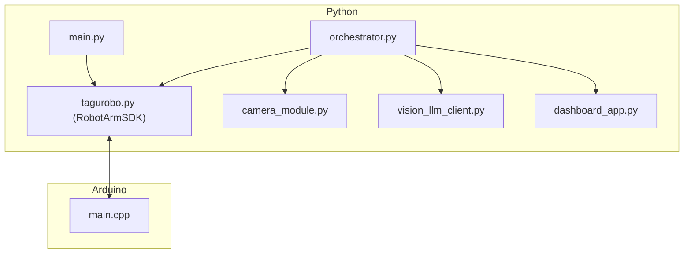
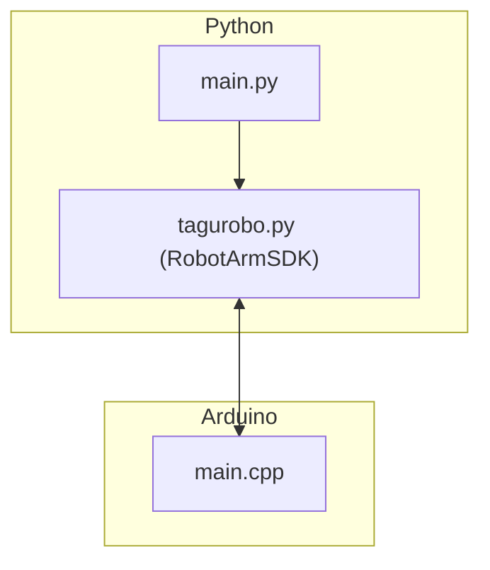

# Robotic Arm Auto Feedback System

This project enables networked and vision-based control of a robotic arm, supporting both fully autonomous and human-in-the-loop feedback modes. The system integrates Arduino firmware, a Python SDK, orchestrator, camera capture, LLM vision analysis, and a web dashboard.

---

## Features

- Control a robotic arm via UDP and Python SDK
- Auto feedback loop using camera and vision LLM (e.g., Gemini 2.0)
- Human-in-the-loop or fully autonomous operation modes
- Web dashboard for reviewing and approving actions
- Modular architecture for easy extension

---

## High-Level Architecture

This project integrates an Arduino-based servo controller with a Python SDK and control script for a robotic arm. The system enables networked control of servos via UDP and provides a Python interface for higher-level operations. It also supports an advanced auto feedback system with human-in-the-loop or fully autonomous modes.



---

## Directory Structure

```
.
├── main.cpp                # Arduino/ESP32 firmware
├── tagurobo.py             # Python SDK for robot control
├── main.py                 # Example usage script
├── orchestrator.py         # Feedback orchestrator (core logic)
├── camera_module.py        # Camera capture module
├── vision_llm_client.py    # Vision LLM integration
├── dashboard_app.py        # Flask web dashboard backend
├── requirements.txt        # Python dependencies
├── architecture.md         # Full architecture documentation
├── static/                 # Frontend assets (index.html, etc.)
└── README.md               # Project overview and instructions
```

---

## File Details

### [`main.cpp`](main.cpp)
Implements the firmware for an ESP32-based controller, handling WiFi, UDP, web server, and servo PWM control for a robotic arm.

### [`tagurobo.py`](tagurobo.py)
Python SDK for controlling the robotic arm via UDP. Provides a high-level API for connection management, joint control, and trajectory execution.

### [`main.py`](main.py)
Example script demonstrating how to use `RobotArmSDK` to control the robotic arm.

### [`orchestrator.py`](orchestrator.py)
Central controller for the feedback system. Coordinates robot commands, camera capture, LLM interaction, and mode control (auto/human approve).

### [`camera_module.py`](camera_module.py)
Handles image capture from a connected camera for feedback and vision analysis.

### [`vision_llm_client.py`](vision_llm_client.py)
Integrates with a vision LLM API (e.g., Gemini 2.0) to analyze images and generate robot commands or feedback.

### [`dashboard_app.py`](dashboard_app.py)
Flask-based web dashboard for human-in-the-loop review, action approval, and mode switching.

- The dashboard serves `static/index.html` at the root URL (`/`).
- Users can interact with the system via their browser at [http://localhost:5000/](http://localhost:5000/).
- You can enhance `static/index.html` to display feedback, approve actions, and control modes.

---

## Auto Feedback System Architecture

### Overview

This system enables a robot to perform actions, capture results via camera, analyze outcomes using a vision LLM, and present feedback to a human operator for review and approval before the next action.

### Operation Modes

- **Auto-Approve Mode:**  
  The LLM generates and sends commands directly to the robot after each analysis, enabling fully autonomous operation.

- **Approve by Human Mode:**  
  The LLM generates a suggested command, but the command is presented to a human operator via the web dashboard for review and approval before being sent to the robot.

A mode flag in the orchestrator and a toggle in the dashboard control which workflow is active.

---

## Sequential Diagrams

### Basic System



### Auto-Approve Mode

```mermaid
sequenceDiagram
    participant H as Human
    participant L as LLM (Vision Model)
    participant F as Feedback Orchestrator
    participant R as Robot Controller
    participant C as Camera Module

    H->>L: Give order (e.g., "pick up object")
    L->>F: Create and send command
    F->>R: Send action command
    R->>C: Perform action, trigger capture
    C->>F: Send captured image
    F->>L: Send image for analysis
    L->>F: Return feedback/suggestion (new command)
    F->>R: Send next action command
    ... (loop continues automatically)
```

### Approve by Human Mode

```mermaid
sequenceDiagram
    participant H as Human
    participant L as LLM (Vision Model)
    participant F as Feedback Orchestrator
    participant R as Robot Controller
    participant C as Camera Module
    participant W as Web Dashboard

    H->>L: Give order (e.g., "pick up object")
    L->>F: Create and send command
    F->>W: Display suggested command for approval
    W->>F: Human approves/edits command
    F->>R: Send action command
    R->>C: Perform action, trigger capture
    C->>F: Send captured image
    F->>L: Send image for analysis
    L->>F: Return feedback/suggestion (new command)
    F->>W: Display next suggested command for approval
    ... (loop continues with human in the loop)
```

---

## Quick Start

### 1. Install Python dependencies

```bash
pip install -r requirements.txt
```

### 2. Run the Web Dashboard

```bash
python dashboard_app.py
```

- Open your browser and go to [http://localhost:5000/](http://localhost:5000/) to access the dashboard UI, served from `static/index.html`.

### 3. Run the Orchestrator

```bash
python orchestrator.py
```

### 4. (Optional) Run Example Robot Control

```bash
python main.py
```

---

## Usage

- Use the web dashboard at [http://localhost:5000/](http://localhost:5000/) to review and approve robot actions, view feedback, or switch to auto-approve mode for full autonomy.
- The dashboard UI is served from `static/index.html` and can be customized to display system status and interact with API endpoints.
- The orchestrator coordinates robot commands, camera capture, and LLM feedback.
- Integrate your own LLM API and camera hardware as needed.

---

## Example API Endpoints

### Feedback Orchestrator

- **POST `/api/action`** — Send a command to the robot.
- **POST `/api/capture`** — Upload a captured image after action.
- **POST `/api/vision`** — Send image to vision LLM and get feedback.

### Web Dashboard

- **GET `/api/feedback/latest`** — Get the latest vision feedback and image.
- **POST `/api/feedback/approve`** — Approve or modify the next action.
- **GET/POST `/api/mode`** — Get or set the current feedback mode.

---

## Data Formats

- **Action Command**
    ```json
    {
      "action": "move_arm",
      "parameters": {"joint": 1, "angle": 90}
    }
    ```
- **Vision Feedback**
    ```json
    {
      "feedback": "Object detected at position X.",
      "suggested_action": {"action": "move_arm", "parameters": {"joint": 2, "angle": 45}}
    }
    ```

---

## Technologies

- Robot: Existing Python SDK
- Camera: USB/CSI camera, OpenCV or similar
- Vision LLM: Cloud API (e.g., Gemini 2.0)
- Web Dashboard: Flask/FastAPI backend + React/Vue frontend
- Orchestrator: Python service (could be part of backend)

---

## Mode Control Implementation Notes

- The orchestrator maintains a mode flag (`auto-approve` or `human-approve`).
- The web dashboard provides a toggle to switch modes.
- In auto-approve mode, commands from the LLM are sent directly to the robot.
- In human-approve mode, commands are routed to the dashboard for review and approval before execution.

---

## Contributing

Contributions are welcome! Please see the architecture diagrams and comments above for system details before submitting pull requests.

---

## License

MIT License